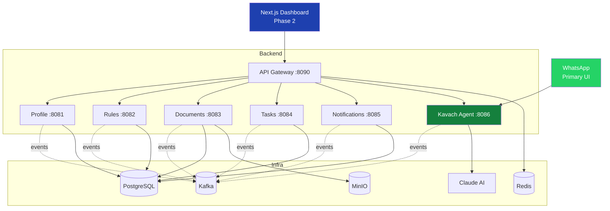

# Niyamitra

**AI-Powered Compliance Platform for Indian SME Manufacturing**

Niyamitra helps small and medium factory owners stay compliant with environmental, fire safety, labor, and licensing regulations through a WhatsApp-first AI assistant (**Kavach AI**) and a web dashboard powered by the **Anupalan** compliance intelligence engine.

---

## Brand Architecture

| Brand | What it is |
|-------|-----------|
| **Niyamitra** | Parent brand — the compliance platform itself |
| **Kavach AI** | WhatsApp AI agent that talks to factory owners in Hindi/English |
| **Anupalan** | Rule engine + compliance score (Anupalan Score 0-100) |

---

## Repository Layout

```
Niyamitra/
├── docs/                              # Architecture & flow documentation
│   ├── architecture.md                # System architecture with diagrams
│   └── flows.md                       # Sequence diagrams for every flow
│
├── niyamitra-common/                  # Shared events, enums, exceptions
├── niyamitra-api-gateway/             # Spring Cloud Gateway (port 8090)
├── niyamitra-profile-service/         # Tenants, users, credentials (8081)
├── anupalan-rule-service/             # Compliance rules engine (8082)
├── niyamitra-document-vault/          # Documents + Kavach Vision (8083)
├── niyamitra-task-service/            # Tasks + Anupalan Score (8084)
├── kavach-notification-service/       # WhatsApp notifications (8085)
├── kavach-floor-manager/              # LangChain4j AI agent (8086)
├── niyamitra-dashboard/               # Next.js 15 dashboard (3000)
│
├── infrastructure/
│   ├── docker/init-db.sql             # PostgreSQL schema init
│   └── kafka/schemas/                 # Avro schemas
│
├── scripts/
│   └── setup-and-test.sh              # Seed data + curl test commands
│
├── docker-compose.yml                 # Infra (PG, Redpanda, Redis, MinIO, Keycloak)
└── pom.xml                            # Maven parent POM
```

---

## Technology Stack

| Layer | Technology |
|-------|-----------|
| Language | Java 21, TypeScript 5.7 |
| Backend | Spring Boot 3.4.3, Spring Cloud 2024.0.0 |
| Messaging | Redpanda (Kafka-compatible) |
| Database | PostgreSQL 16 with Flyway migrations |
| Object Storage | MinIO (S3-compatible) |
| Cache | Redis 7 |
| Auth | Keycloak 24 |
| AI Framework | LangChain4j 1.0.0-beta2 |
| LLM | Anthropic Claude Haiku |
| Frontend | Next.js 15 + React 19 + Tailwind CSS + Recharts |

---

## Quick Start

### Prerequisites

- Java 21
- Maven 3.9+
- Node.js 20+
- Docker + Docker Compose
- (Optional) Anthropic API key for Kavach AI

### 1. Start Infrastructure

```bash
docker compose up -d
```

This starts:
- PostgreSQL at `localhost:5432`
- Redpanda (Kafka) at `localhost:9092`
- Redpanda Console at `http://localhost:8888`
- Redis at `localhost:6379`
- MinIO at `http://localhost:9000` (console `:9001`)
- Keycloak at `http://localhost:8080`

### 2. Build All Java Modules

```bash
mvn clean install -DskipTests
```

### 3. Run Microservices

Open 7 terminals (one per service) and run:

```bash
# Terminal 1 - Profile Service (8081)
mvn -pl niyamitra-profile-service spring-boot:run

# Terminal 2 - Anupalan Rule Service (8082)
mvn -pl anupalan-rule-service spring-boot:run

# Terminal 3 - Document Vault (8083)
mvn -pl niyamitra-document-vault spring-boot:run

# Terminal 4 - Task Service (8084)
mvn -pl niyamitra-task-service spring-boot:run

# Terminal 5 - Notification Service (8085)
mvn -pl kavach-notification-service spring-boot:run

# Terminal 6 - Kavach Floor Manager (8086)
# Requires: export ANTHROPIC_API_KEY=sk-ant-...
mvn -pl kavach-floor-manager spring-boot:run

# Terminal 7 - API Gateway (8090)
mvn -pl niyamitra-api-gateway spring-boot:run
```

### 4. Run the Dashboard (Phase 2)

```bash
cd niyamitra-dashboard
npm install
npm run dev
```

Open `http://localhost:3000` — it proxies API calls to the gateway at `:8090`.

### 5. Seed Data & Test

```bash
./scripts/setup-and-test.sh
```

This script creates 2 tenants, 3 users, 4 compliance tasks and runs all API tests.

---

## Architecture at a Glance



**Full diagrams:** see [`docs/architecture.md`](docs/architecture.md) and [`docs/flows.md`](docs/flows.md).

---

## Phase Roadmap

| Phase | Weeks | Deliverables | Status |
|-------|-------|--------------|--------|
| **Phase 1** | 1-8 | 7 microservices, Kavach AI on WhatsApp, event-driven core | Done |
| **Phase 2** | 9-16 | Next.js dashboard, Anupalan Score UI, Kavach Vision (doc extraction), Gazette Watcher | In progress |
| **Phase 3** | 17-24 | Portal Navigator (auto-fill gov portals via Python worker) | Pending |
| **Phase 4** | 25-32 | React Native mobile app, multi-region scale | Pending |

---

## Key Features

### Phase 1 (Complete)

- **WhatsApp-first AI agent** (Kavach) with Hindi/English support
- **6 @Tool functions** for task query, reschedule, document linking, escalation
- **Event-driven architecture** with 11 Kafka topics
- **Auto compliance task generation** from industry + state rules
- **AES-256-GCM encrypted** portal credentials
- **Escalation matrix** T-30, T-15, T-5 with auto-escalation to owner
- **Anupalan Score** calculation (weighted compliance health metric)
- **Daily scheduler** for expiry checks at 06:00 IST

### Phase 2 (In Progress)

- **Next.js 15 Dashboard** with:
  - Anupalan Score gauge (SVG)
  - Task distribution pie chart
  - Upcoming deadlines panel
  - Compliance trend area chart
  - Task management (filter, detail, actions)
  - Document vault (upload, preview, extract)
  - Notifications history
  - Tenant & user onboarding
- **Kavach Vision** — document AI extraction (metadata, category, type detection)
- **Notification REST API** for dashboard integration
- **CORS-enabled API Gateway** for frontend

---

## API Endpoints

All endpoints are routed through the API Gateway at `http://localhost:8090`.

### Tenants (Profile Service)
```
POST   /api/v1/tenants/onboard
GET    /api/v1/tenants/{id}
PUT    /api/v1/tenants/{id}
GET    /api/v1/tenants/{tenantId}/users
POST   /api/v1/tenants/{tenantId}/users
POST   /api/v1/tenants/{tenantId}/credentials
GET    /api/v1/tenants/{tenantId}/credentials/{portalName}
```

### Tasks
```
GET    /api/v1/tasks?tenantId=...
POST   /api/v1/tasks
GET    /api/v1/tasks/{id}
PUT    /api/v1/tasks/{id}/status?status=...
PUT    /api/v1/tasks/{id}/reschedule?newDueDate=...&reason=...
PUT    /api/v1/tasks/{id}/acknowledge
GET    /api/v1/tasks/dashboard?tenantId=...
GET    /api/v1/tasks/anupalan-score?tenantId=...
```

### Documents
```
POST   /api/v1/documents/upload      (multipart)
GET    /api/v1/documents?tenantId=...
GET    /api/v1/documents/{id}
GET    /api/v1/documents/{id}/download-url
DELETE /api/v1/documents/{id}
```

### Anupalan Rules
```
GET    /api/v1/anupalan/rules/applicable?industry=...&state=...
GET    /api/v1/anupalan/rules/{id}
POST   /api/v1/anupalan/rules
GET    /api/v1/anupalan/rules/categories
```

### Kavach Notifications
```
GET    /api/v1/kavach/notifications?tenantId=...
GET    /api/v1/kavach/notifications/{id}
```

### Kavach WhatsApp Webhook
```
GET    /api/v1/kavach/webhook        (Meta verification)
POST   /api/v1/kavach/webhook        (Incoming messages)
```

---

## Configuration

### Environment Variables

| Variable | Purpose | Default |
|----------|---------|---------|
| `ANTHROPIC_API_KEY` | Claude LLM for Kavach agent | (required for AI) |
| `WHATSAPP_ACCESS_TOKEN` | Meta Cloud API token | (stubbed in dev) |
| `WHATSAPP_PHONE_NUMBER_ID` | Meta phone number ID | (stubbed in dev) |
| `NIYAMITRA_ENCRYPTION_KEY` | AES-256-GCM master key | (dev default) |
| `SPRING_DATASOURCE_URL` | PostgreSQL JDBC URL | `jdbc:postgresql://localhost:5432/niyamitra` |
| `SPRING_KAFKA_BOOTSTRAP_SERVERS` | Kafka brokers | `localhost:9092` |

### Port Conflicts

If port `9001` (MinIO console) is in use locally, edit `docker-compose.yml` and change:
```yaml
- "9001:9001"   →   - "9002:9001"
```

---

## Development

### Running a single service

```bash
mvn -pl niyamitra-task-service -am spring-boot:run
```

### Running tests

```bash
mvn test
```

### Database migrations

Each service owns its own Flyway migrations under `src/main/resources/db/migration/`. On service startup, Flyway auto-applies any pending migrations.

### Kafka event monitoring

Open Redpanda Console at `http://localhost:8888` to browse topics, consumer groups, and message contents.

---

## Documentation

| Document | Contents |
|----------|----------|
| [`docs/architecture.md`](docs/architecture.md) | System architecture, component diagrams, tech choices, deployment topology |
| [`docs/flows.md`](docs/flows.md) | 8 detailed sequence diagrams for every business flow |

---

## License

Proprietary — Niyamitra Platform
