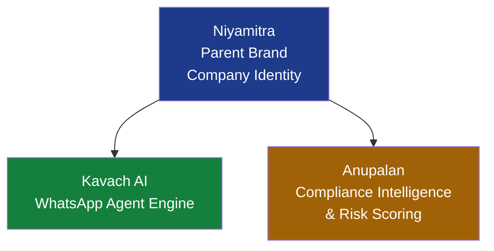
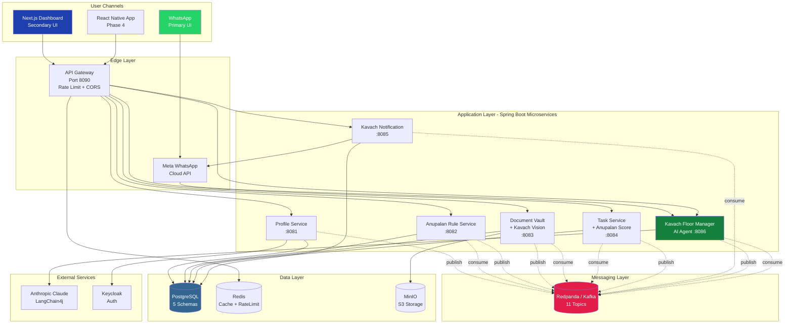
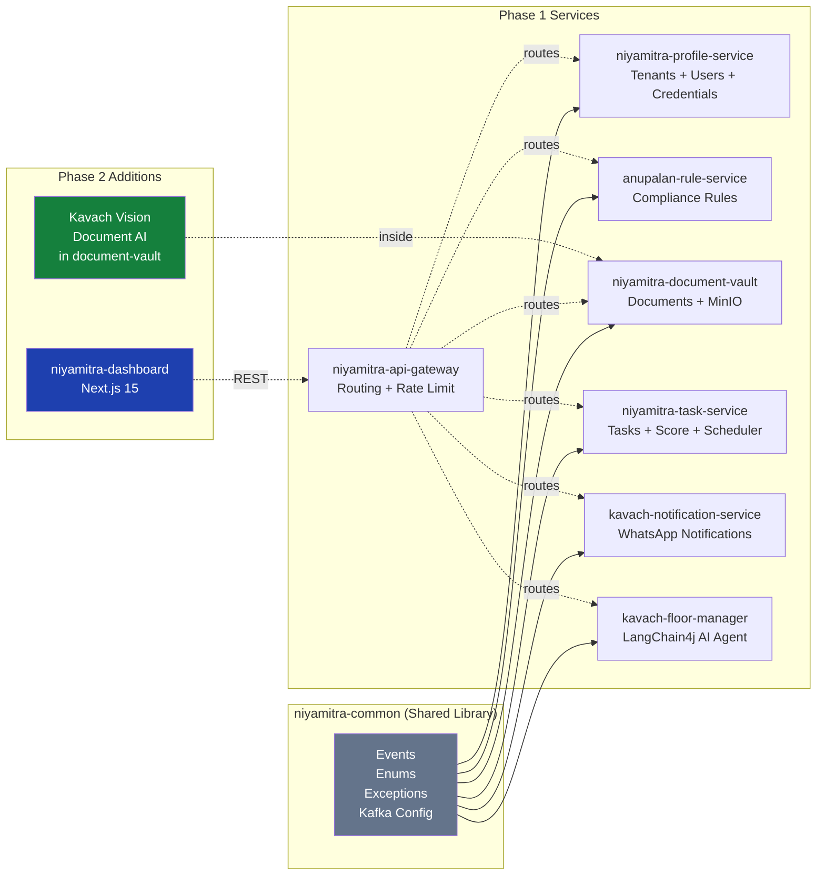
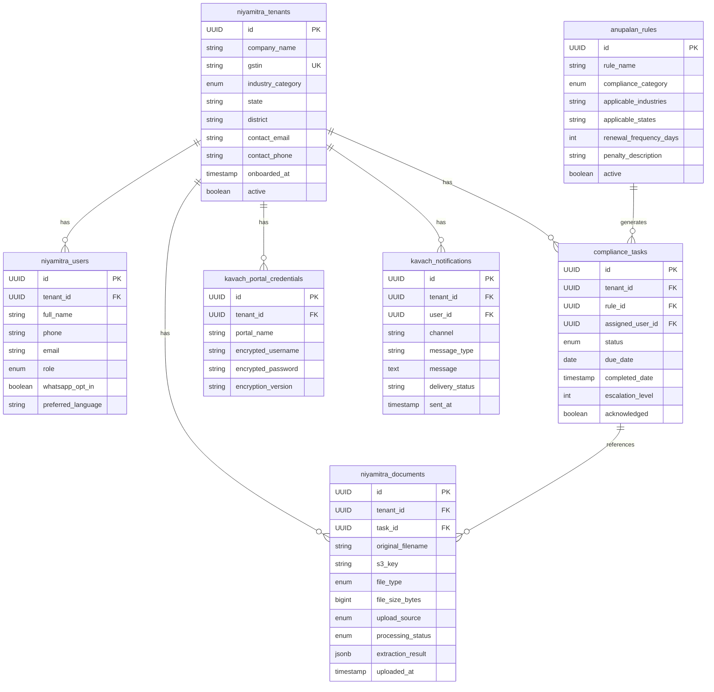
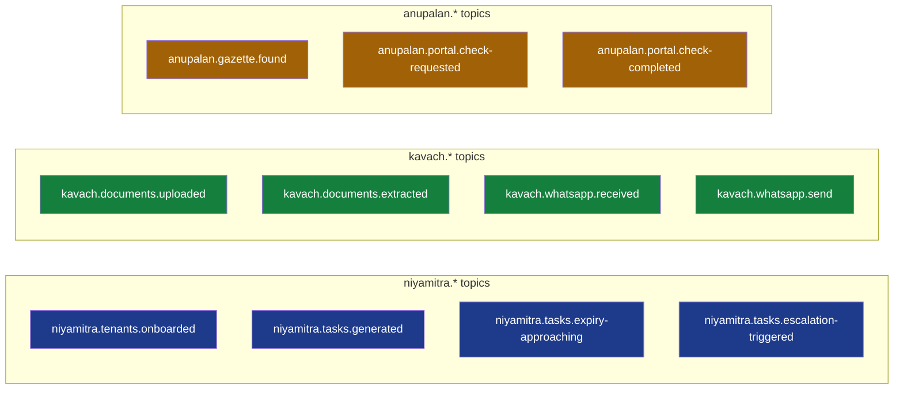
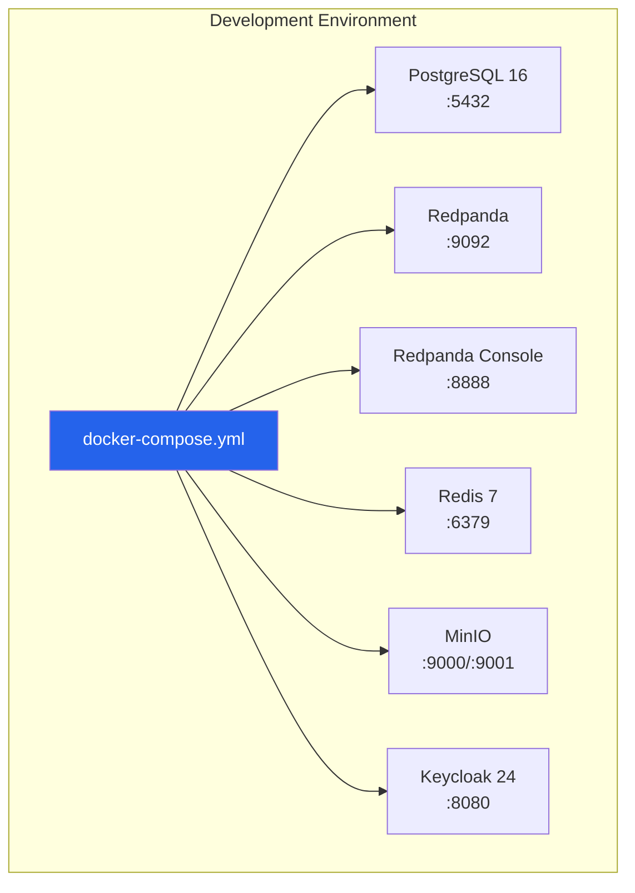

# Niyamitra Architecture

This document describes the complete system architecture of the Niyamitra compliance platform across all phases.

## Table of Contents

1. [Brand Hierarchy](#brand-hierarchy)
2. [High-Level Architecture](#high-level-architecture)
3. [Microservices Map](#microservices-map)
4. [Data Architecture](#data-architecture)
5. [Event-Driven Architecture](#event-driven-architecture)
6. [Infrastructure Stack](#infrastructure-stack)
7. [Deployment Topology](#deployment-topology)

---

## Brand Hierarchy

Niyamitra follows a three-tier brand architecture:



| Brand | Role | Examples |
|-------|------|----------|
| **Niyamitra** | Parent brand, core platform | `niyamitra-profile-service`, `niyamitra-tasks`, `niyamitra-dashboard` |
| **Kavach** | AI agents + WhatsApp interface | `kavach-floor-manager`, `kavach-notification-service`, Kavach Vision |
| **Anupalan** | Compliance rule engine + scoring | `anupalan-rule-service`, Anupalan Score, Anupalan Rules |

---

## High-Level Architecture



---

## Microservices Map



### Service Responsibilities

| Service | Port | Responsibility | Key Domain |
|---------|------|----------------|------------|
| `niyamitra-api-gateway` | 8090 | Edge routing, CORS, rate limiting | Gateway |
| `niyamitra-profile-service` | 8081 | Tenants, users, portal credentials (AES-256-GCM encrypted) | Identity |
| `anupalan-rule-service` | 8082 | Compliance rules, rule matching, auto task generation | Compliance |
| `niyamitra-document-vault` | 8083 | Document storage (MinIO), Kavach Vision extraction | Documents |
| `niyamitra-task-service` | 8084 | Tasks, Anupalan Score calculation, expiry scheduler | Tasks |
| `kavach-notification-service` | 8085 | WhatsApp notifications, notification history | Notifications |
| `kavach-floor-manager` | 8086 | LangChain4j AI agent, WhatsApp webhook, 6 @Tool methods | AI Agent |
| `niyamitra-dashboard` | 3000 | Next.js 15 web UI (Phase 2) | Web UI |

---

## Data Architecture

### Database Schema Layout (Single PostgreSQL)



### Schema Isolation

| Schema | Owner Service | Tables |
|--------|---------------|--------|
| `niyamitra_profiles` | profile-service | `niyamitra_tenants`, `niyamitra_users`, `kavach_portal_credentials` |
| `anupalan_rules` | rule-service | `anupalan_rules` |
| `niyamitra_documents` | document-vault | `niyamitra_documents` |
| `niyamitra_tasks` | task-service | `compliance_tasks` |
| `kavach_notifications` | notification-service | `kavach_notifications`, `anupalan_gazette_notifications` |

Each service owns its own schema — no cross-schema joins. Cross-service queries happen via Kafka events.

---

## Event-Driven Architecture

### Kafka Topic Catalog (11 Topics)



### Publish/Subscribe Matrix

| Topic | Publisher | Consumer(s) |
|-------|-----------|-------------|
| `niyamitra.tenants.onboarded` | profile-service | anupalan-rule-service |
| `niyamitra.tasks.generated` | anupalan-rule-service | task-service |
| `niyamitra.tasks.expiry-approaching` | task-service (scheduler) | kavach-notification-service |
| `niyamitra.tasks.escalation-triggered` | task-service, kavach-floor-manager | kavach-notification-service |
| `kavach.documents.uploaded` | document-vault | **Kavach Vision** (in document-vault) |
| `kavach.documents.extracted` | Kavach Vision | task-service |
| `kavach.whatsapp.received` | kavach-floor-manager (webhook) | kavach-floor-manager (agent) |
| `kavach.whatsapp.send` | kavach-floor-manager, anywhere | kavach-notification-service |
| `anupalan.gazette.found` | gazette-watcher (Phase 2) | kavach-notification-service |
| `anupalan.portal.check-requested` | task-service | portal-navigator (Phase 3) |
| `anupalan.portal.check-completed` | portal-navigator | task-service |

---

## Infrastructure Stack



### Technology Choices

| Layer | Technology | Rationale |
|-------|-----------|-----------|
| Language | Java 21 | LTS, virtual threads, pattern matching |
| Framework | Spring Boot 3.4.3 | Mature ecosystem, production-ready |
| API Gateway | Spring Cloud Gateway | Reactive, Redis rate-limit integration |
| Messaging | Redpanda (Kafka-compatible) | Lightweight, no Zookeeper |
| Database | PostgreSQL 16 | JSONB for extractions, mature tooling |
| Object Storage | MinIO | S3-compatible, self-hosted |
| Cache | Redis 7 | Gateway rate limit, session cache |
| Auth | Keycloak 24 | OAuth2/OIDC, multi-tenant realms |
| AI Framework | LangChain4j | Java-native, type-safe @Tool bindings |
| LLM | Anthropic Claude Haiku | Fast, cost-efficient, function calling |
| Frontend | Next.js 15 + React 19 | Server components, modern DX |
| Styling | Tailwind CSS 3.4 | Utility-first, small bundle |
| Charts | Recharts | React-native, composable |
| Migrations | Flyway | Per-schema versioning |

---

## Deployment Topology

### Development (current)
```
All services on localhost
┌─────────────────────────────────────────┐
│  Docker Compose (infrastructure)        │
│  ├─ PostgreSQL 5432                     │
│  ├─ Redpanda 9092                       │
│  ├─ Redis 6379                          │
│  ├─ MinIO 9000/9001                     │
│  └─ Keycloak 8080                       │
│                                         │
│  Maven (mvn spring-boot:run per svc)    │
│  ├─ :8081 profile-service               │
│  ├─ :8082 anupalan-rule-service         │
│  ├─ :8083 niyamitra-document-vault      │
│  ├─ :8084 niyamitra-task-service        │
│  ├─ :8085 kavach-notification-service   │
│  ├─ :8086 kavach-floor-manager          │
│  └─ :8090 niyamitra-api-gateway         │
│                                         │
│  Next.js (npm run dev)                  │
│  └─ :3000 niyamitra-dashboard           │
└─────────────────────────────────────────┘
```

### Production (target)
```
┌─────────────────────────────────────────┐
│  Kubernetes Cluster                     │
│  ├─ Ingress (NGINX/Istio)               │
│  ├─ API Gateway (3 replicas)            │
│  ├─ Backend services (2-5 replicas)     │
│  ├─ HPA based on CPU/memory/queue depth │
│  └─ Cert-manager + external-dns         │
│                                         │
│  Managed Services                       │
│  ├─ AWS RDS PostgreSQL (Multi-AZ)       │
│  ├─ AWS MSK (Kafka)                     │
│  ├─ AWS ElastiCache (Redis)             │
│  ├─ AWS S3 (object storage)             │
│  └─ Keycloak (EKS or Cloud IAM)         │
└─────────────────────────────────────────┘
```

---

## Cross-References

- [Event Flow Diagrams](./flows.md) — Detailed sequence diagrams for each business flow
- [README](../README.md) — Getting started, local setup, running services
