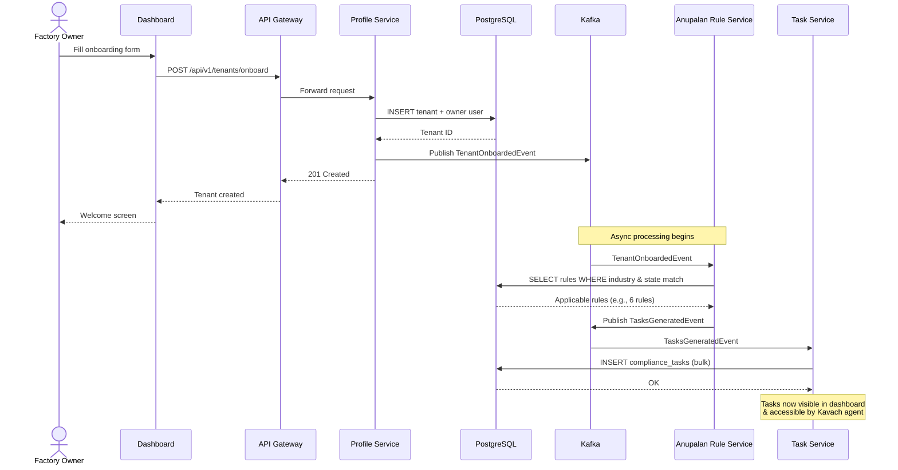
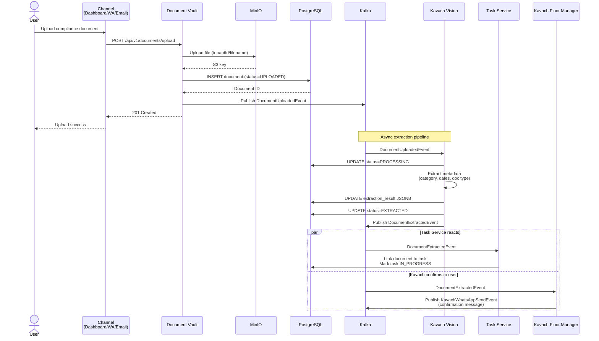
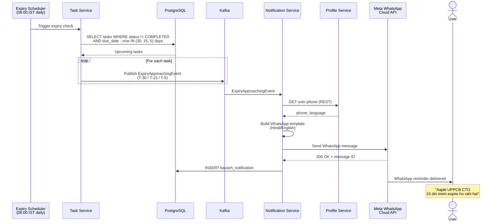
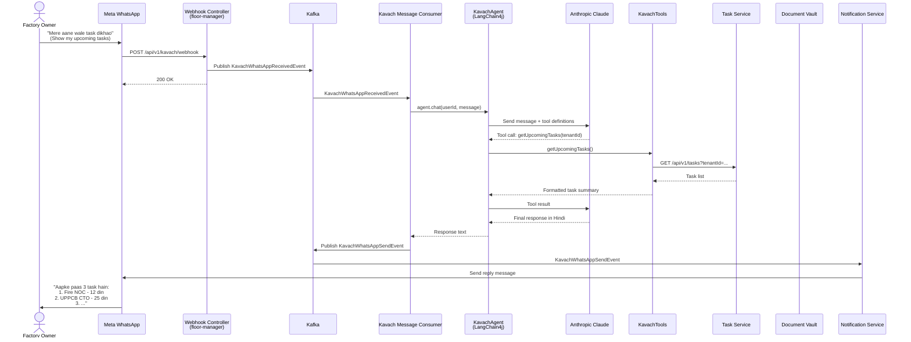
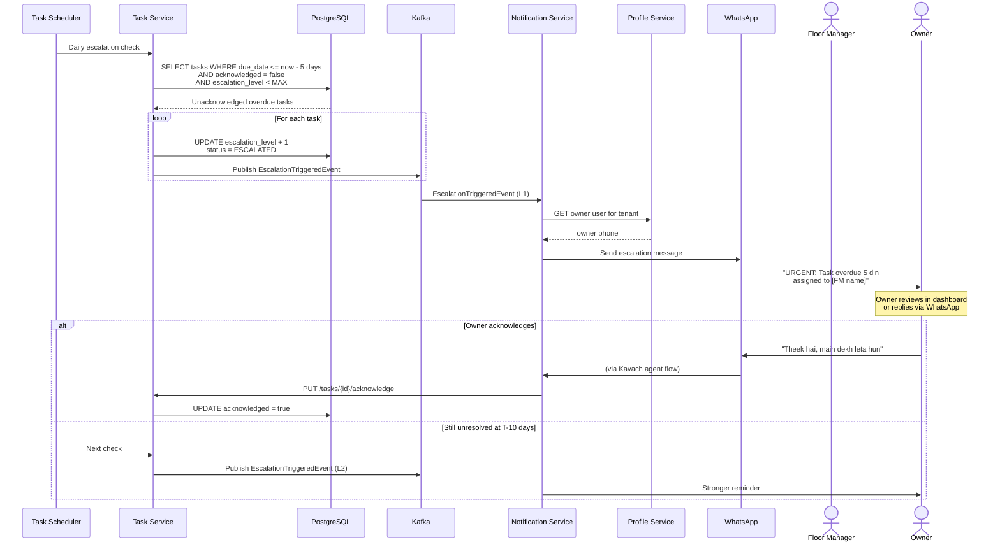
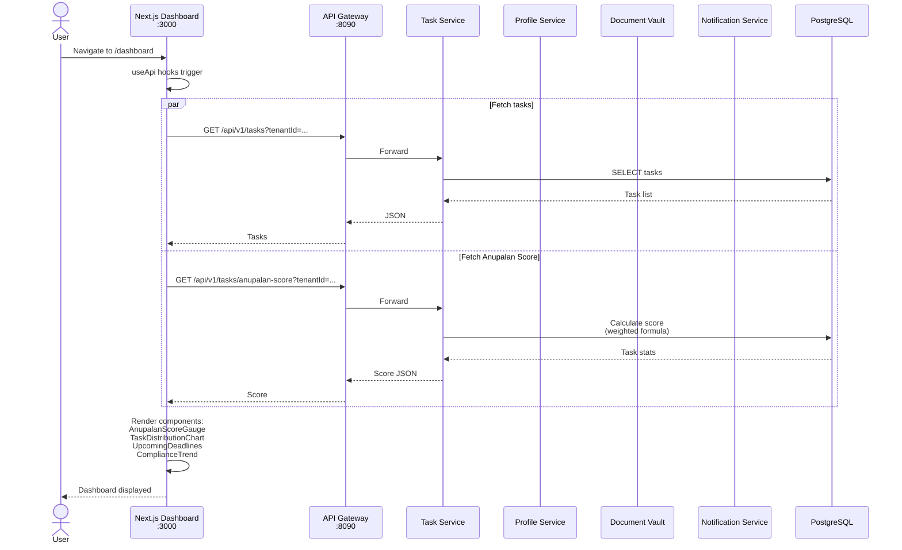
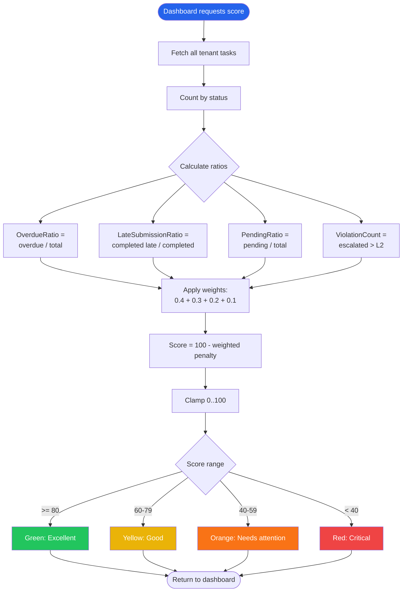
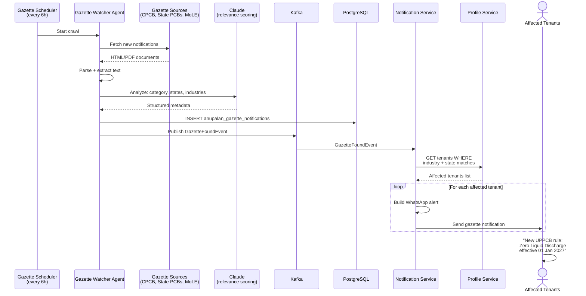

# Niyamitra Event Flow Diagrams

This document contains detailed sequence diagrams for every business flow in the Niyamitra platform.

## Table of Contents

1. [Tenant Onboarding Flow](#1-tenant-onboarding-flow)
2. [Document Upload → Extraction Flow](#2-document-upload--extraction-flow)
3. [Task Expiry → Notification Flow](#3-task-expiry--notification-flow)
4. [WhatsApp Conversation Flow (Kavach AI)](#4-whatsapp-conversation-flow-kavach-ai)
5. [Escalation Flow](#5-escalation-flow)
6. [Dashboard Data Flow](#6-dashboard-data-flow)
7. [Anupalan Score Calculation](#7-anupalan-score-calculation)
8. [Gazette Watcher Flow (Phase 2)](#8-gazette-watcher-flow-phase-2)

---

## 1. Tenant Onboarding Flow

**Trigger:** New factory owner signs up (via dashboard or onboarding API)

**Outcome:** Tenant created, compliance tasks auto-generated based on industry & state



**Key Files:**
- `niyamitra-profile-service/TenantService.java` — Publishes `TenantOnboardedEvent`
- `anupalan-rule-service/TenantOnboardedConsumer.java` — Consumes event, generates tasks
- `niyamitra-task-service/TaskEventConsumer.java` — Creates tasks in DB

---

## 2. Document Upload → Extraction Flow

**Trigger:** User uploads document via Dashboard, WhatsApp (Kavach), or email

**Outcome:** Document stored, Kavach Vision extracts data, task status updated if applicable



**Key Files:**
- `niyamitra-document-vault/DocumentService.java` — Upload + publish event
- `niyamitra-document-vault/KavachVisionService.java` — Metadata extraction (Phase 2)
- `niyamitra-task-service/TaskEventConsumer.java` — Consumes `DocumentExtractedEvent`

---

## 3. Task Expiry → Notification Flow

**Trigger:** Daily cron at 06:00 IST scans all active tasks

**Outcome:** Users receive WhatsApp reminders at T-30, T-15, T-5 days before deadline



**Key Files:**
- `niyamitra-task-service/ExpiryCheckScheduler.java` — Daily cron
- `niyamitra-task-service/TaskService.java` — Publishes `ExpiryApproachingEvent`
- `kavach-notification-service/KavachEventConsumer.java` — Handles expiry events
- `kavach-notification-service/WhatsAppService.java` — Meta Cloud API client

---

## 4. WhatsApp Conversation Flow (Kavach AI)

**Trigger:** User sends WhatsApp message to Kavach

**Outcome:** LLM agent responds with contextual answer using @Tool function calling



**Available @Tool Functions:**

| Tool | Description |
|------|-------------|
| `getUpcomingTasks` | List tasks due in next 30 days |
| `getTaskDetails` | Full details for a specific task |
| `rescheduleTask` | Move due date with reason |
| `markDocumentReceived` | Link uploaded doc to task |
| `escalateToOwner` | Publish escalation event |
| `searchAnupalanRules` | Query rule database |

**Key Files:**
- `kavach-floor-manager/WhatsAppWebhookController.java`
- `kavach-floor-manager/KavachMessageConsumer.java`
- `kavach-floor-manager/KavachAgent.java` (LangChain4j `@AiService`)
- `kavach-floor-manager/KavachTools.java` (6 `@Tool` methods)

---

## 5. Escalation Flow

**Trigger:** Task is 5 days overdue AND not acknowledged by assigned user

**Outcome:** Owner receives escalation WhatsApp; task level incremented



**Key Files:**
- `niyamitra-task-service/TaskService.java` — `checkAndEscalate()` logic
- `niyamitra-task-service/ExpiryCheckScheduler.java`
- `kavach-notification-service/KavachEventConsumer.java` — `onEscalation()`

---

## 6. Dashboard Data Flow

**Trigger:** User opens Next.js dashboard at `/dashboard`

**Outcome:** Dashboard renders Anupalan Score, task charts, upcoming deadlines



**Anupalan Score Formula:**
```
Score = 100 - (0.4 × OverdueRatio × 100
             + 0.3 × LateSubmissionRatio × 100
             + 0.2 × PendingRatio × 100
             + 0.1 × ViolationCount × 10)
```

**Key Files:**
- `niyamitra-dashboard/src/app/dashboard/page.tsx` — Dashboard page
- `niyamitra-dashboard/src/lib/api.ts` — API client
- `niyamitra-task-service/AnupalanScoreService.java` — Score calculation

---

## 7. Anupalan Score Calculation



---

## 8. Gazette Watcher Flow (Phase 2)

**Trigger:** Scheduled crawler runs every 6 hours

**Outcome:** New regulatory updates trigger notifications to affected tenants



**Note:** Gazette Watcher is a Phase 2 deliverable — skeleton will be added next.

---

## Cross-References

- [Architecture Overview](./architecture.md) — System topology and components
- [README](../README.md) — Getting started guide
